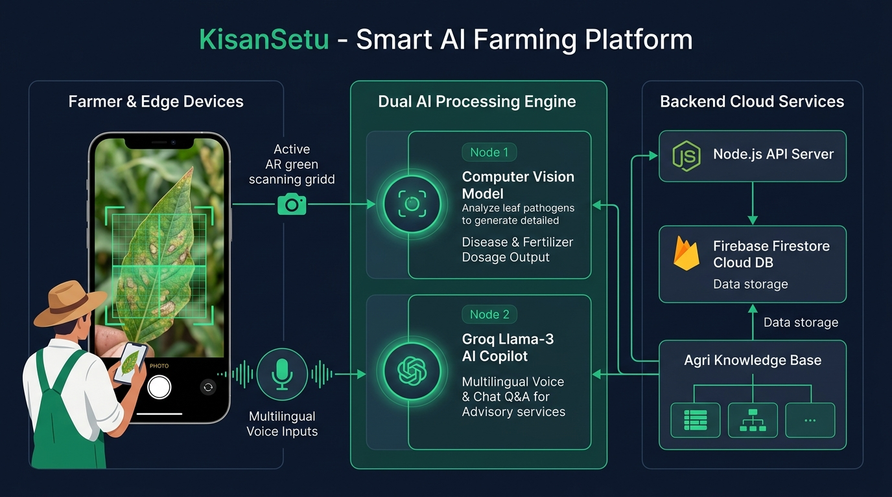

# 🌾 KisanSetu (किसान सेतु) — AI-Powered Smart Agriculture & Pathology Platform

[](https://opensource.org/licenses/MIT)
[](https://react.dev/)
[](https://flutter.dev/)
[](https://groq.com/)
[](https://tailwindcss.com/)

> **Bridging the gap between smallholder farmers and precision agricultural intelligence through Edge Computer Vision, AR Foliar Scanners, Multilingual Voice Copilots, and Government Scheme Integrations.**

---

## 🏛️ System Architecture



### **Architecture Overview & Data Flow:**
1. **Client & Presentation Layer:**
   - **Cross-Platform Clients:** Flutter Mobile App (Android/iOS) + React 18 / TypeScript Web PWA.
   - **Input Modalities:** Real-time WebAR Camera Leaf Scanner + Web Speech Audio Recognition (Voice-to-Text & Text-to-Speech).
2. **Application Core Layer:**
   - **Canvas Pixel & Pathology Analyzer:** Extracts HSV, greenness/chlorophyll indexes, and lesion coordinates.
   - **Draggable AI Copilot UI:** Draggable Mini/Fullscreen modal with voice controls.
   - **Zustand State Store:** Global reactive state management for scans, crops, and telemetry.
3. **Dual AI Processing Engine:**
   - **Node 1 (Vision AI):** Instant leaf pathogen diagnosis, severity score (%), and exact 3-tier fertilizer/pesticide dosage calculation.
   - **Node 2 (Groq Llama-3.3 70B):** Conversational agronomist supporting 14+ Indian regional languages and welfare advisories.
4. **Backend & Cloud Layer:**
   - **Server:** Node.js / Express REST API.
   - **Database:** Firebase Cloud Firestore for historical crop health tracking, user profiles, and offline caches.

---

## 🌟 Key Features

### 1. 📷 Real-Time AR Crop Scanner & Pathology Doctor
- **1-Click Diagnosis:** Snap or upload a leaf photo to diagnose diseases in under 2 seconds.
- **Accurate Fertilizer Recipes:** Delivers exact chemical remedies (e.g., *Mancozeb 75% WP @ 2g/L*), organic bio-fungicides (*Trichoderma viride*), and recovery nutrients (*NPK 19:19:19*).
- **🛡️ Smart Non-Plant Rejection:** Detects non-agricultural objects (shoes, electronics, faces) and politely guides the farmer back to plant leaves.

### 2. 🎙️ Screen-Reading Voice Copilot (14+ Indian Languages)
- **"Read Screen" Engine:** Automatically synthesizes and **speaks aloud** whatever is on the screen in Telugu, Hindi, Tamil, Kannada, Marathi, English, and more.
- **Voice-to-Voice AI:** Farmers can speak into the microphone to ask any agronomic or government scheme question.

### 3. 🏛️ Kisan Suvidha Government & Mandi Hub
- **PM-KISAN Tracker:** Beneficiary status and 3x installment verification (₹2,000 x 3 = ₹6,000/yr).
- **PMFBY Crop Insurance Calculator:** Calculates Sum Insured, Farmer Share (1.5%–2%), and Government Subsidies.
- **AGMARKNET Live Mandi Prices:** Daily modal rates and arrival volumes across 2,800+ Indian APMC mandis.
- **Soil Health Assessment:** 12-parameter soil card evaluation and nearest Soil Testing Lab locator.
- **SMAM 40%–50% Machinery Grants:** Subsidies for Tractors, RTK Drones, Sprayers, and Custom Hiring Centers (CHCs).
- **Certified Dealers & Kisan Rath Logistics:** Directory of verified seed, fertilizer, and cold-chain transport networks.

### 4. 🚜 3D Interactive Virtual Farm & Equipment Digital Twins
- **Three.js Visualizer:** 360° interactive 3D digital twins of tractors, boom sprayers, and virtual farm crop canopies.
- **Interactive Training Hub:** 5-point safety inspection modules and step-by-step agronomist certification.

---

## 📊 Existing vs Proposed System

| Parameter | Traditional / Existing Apps | KisanSetu (Proposed Platform) |
| :--- | :--- | :--- |
| **Disease Diagnosis** | Slow manual visits or delayed photo uploads. | **Real-Time AR Vision:** Instant lesion localization in < 2s. |
| **Fertilizer Guidance** | Vague suggestions without specific ratios. | **Calibrated 3-Tier Dosages:** Exact chemical, bio-fungicide, and NPK formulas. |
| **Language & Voice** | Complex text-heavy English/Hindi UI. | **Voice-to-Voice in 14+ Indian Languages** + **"Read Screen"** TTS. |
| **Out-of-Domain Filter**| Hallucinates disease for non-plant photos. | **Intelligent Guardrails:** Rejects non-plant items with clear notices. |
| **Government Schemes** | Scattered across complex portals. | **Unified Kisan Suvidha Hub:** Integrated PM-KISAN, PMFBY, and SMAM. |
| **Platform Access** | Heavy apps requiring high-end phones. | **Lightweight Flutter APK + Offline-Ready React PWA**. |

---

## 🛠️ Tech Stack & Resources

- **Frontend:** React 18, TypeScript, Vite, TailwindCSS v4, Lucide Icons, Three.js / React Three Fiber
- **Mobile Client:** Flutter 3.47 (Dart), InAppWebView
- **AI & Reasoning:** Groq Cloud Inference API (`llama-3.3-70b-versatile`), Web Speech API (STT/TTS)
- **Computer Vision:** Canvas Pixel Pathology Engine (HSV color space, chlorophyll extraction)
- **Backend & Cloud:** Node.js, Express.js, Firebase (Firestore, Auth)
- **Datasets:** PlantVillage Dataset (50,000+ leaf images), ICAR Dosage Guidelines, AGMARKNET Mandi feeds

---

## 🚀 Quick Start & Installation

### Prerequisites:
- Node.js (v18+)
- npm or yarn
- Flutter SDK (Optional for mobile APK builds)

### 1. Clone the Repository
```bash
git clone https://github.com/Akhil-jatoth/KIsaan-Setu.git
cd KIsaan-Setu
```

### 2. Run the Web Application
```bash
cd client
npm install
npm run dev
```
Open your browser at `http://localhost:5173/` (or on your phone at `http://<your-local-ip>:5173/`).

### 3. Run the Backend API Server (Optional)
```bash
cd ../server
npm install
npm run dev
```

### 4. Build Standalone Android APK
```bash
cd ../kisan_setu_flutter
flutter pub get
flutter build apk --release
```
The compiled APK will be at: `kisan_setu_flutter/build/app/outputs/flutter-apk/app-release.apk`.

---

## 📂 Project Structure

```
├── client/                     # React 18 + Vite + TailwindCSS Frontend
│   ├── src/
│   │   ├── components/         # Navbar, BottomNav, FarmerCopilot, 3D Scenes
│   │   ├── pages/              # ARAssistantPage, KisanSuvidhaPage, DashboardPage, etc.
│   │   ├── services/           # aiService.ts, groqService.ts, weatherService.ts
│   │   ├── store/              # appStore.ts (Zustand Global State)
│   │   └── types/              # TypeScript interfaces
├── server/                     # Node.js + Express REST API
├── kisan_setu_flutter/         # Flutter Mobile Android/iOS App
│   ├── lib/main.dart           # Standalone WebView Shell with offline fallback
│   ├── assets/web/             # Bundled offline web production assets
│   └── build_apk.bat           # 1-Click APK build script
├── docs/                       # Architecture diagrams & presentation materials
│   ├── architecture_diagram.jpg
│   ├── system_architecture_slide.jpg
│   └── presentation_slides_content.md
├── KisanSetu_Presentation.pptx # Ready-to-Present PowerPoint Presentation
└── README.md
```

---

## 👥 Authors & Team
- **Project Lead & Developer:** Akhil Jatoth
- **Repository:** [https://github.com/Akhil-jatoth/KIsaan-Setu](https://github.com/Akhil-jatoth/KIsaan-Setu)

---
*Built with ❤️ for Indian Farmers & Precision Agriculture.*
